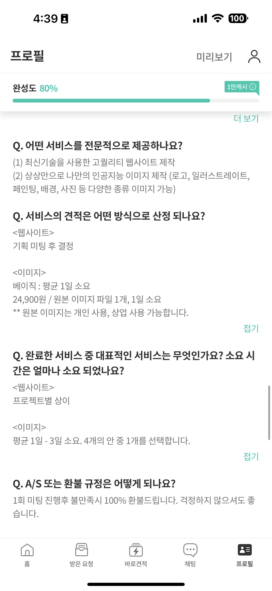
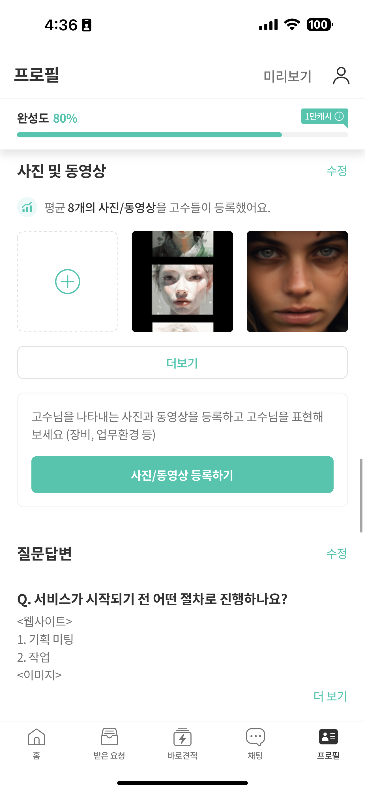

## Setting up my Soomgo Profile

The most important part of the Soomgo profile is the description of your expertise. Considering people are flooded with new information on a daily basis, I want to be clear and concise about what I offer to them. Also, I am fully aware that images can help catch people's attention and convey more information in a confined attention span. So, rather than putting a full description in a paragraph, I wanted to break them down using numbers and brackets. I also added a full generative AI image portfolio as a separate file so that customers who want to know more about the service can easily do so with a single touch. All in all, cut to the chase is what I aimed for when setting up my Soomgo profile.

Description             |  Portfolio
:-------------------------:|:-------------------------:
  |  

## Responding to Customers' Requests

The good thing about Soomgo is its mobile-first approach. Even if you can do everything on its website, its notifications and direct-to-customer chat services make everything so easy. Whenever a new customer uploads a new request, Soomgo notifies you with its in-app notification, just like when you receive a new chat from your friend via WhatsApp. I can then go ahead and look through the request and decide if I want to send my quote to the customer or not. If I find the request doable, I can then send my quote directly to the customer. If the customer is curious and wants to know more about the service, they will start a chat directly, and off we go.

## Understanding Soomgo's Fees

Here is a catch, though. The main business model of Soomgo is charging experts a certain amount of fees. If an expert wants to respond to a request with his quote (offer), he has to pay a fee ranging from $1 to $4, depending on how many experts have responded to the request. The more experts that responded, the higher the price subsequent experts must pay to get inside the pool of experts for that specific request. This naturally means if you act early in sending a quote, you will likely send quotes with a lower price. Soomgo did a great job of introducing competition among experts in pursuit of capturing customers' attention, which rewards experts who respond fast and offer the best service.

This particular request costs about `$1` to send quote.

> NOTE: It is important to note that we have to be mindful of the potential revenue that can be generated with a request. If the request doesn't show a prospective return of more than `$15`, it's not worth sending a quote. When I sent a quote, I was expecting the request to be worth at least `$20`.

## My First Customer

After responding to 6-7 requests, I was able to start a conversation with the customer who's looking to make a line art sunflower illustration. This was a perfect match for what I can do with generative AI. I expected the time I must spend to be less than 2 hours, so I priced the service at around $22. Luckily, the customer agreed, and the work was on!
